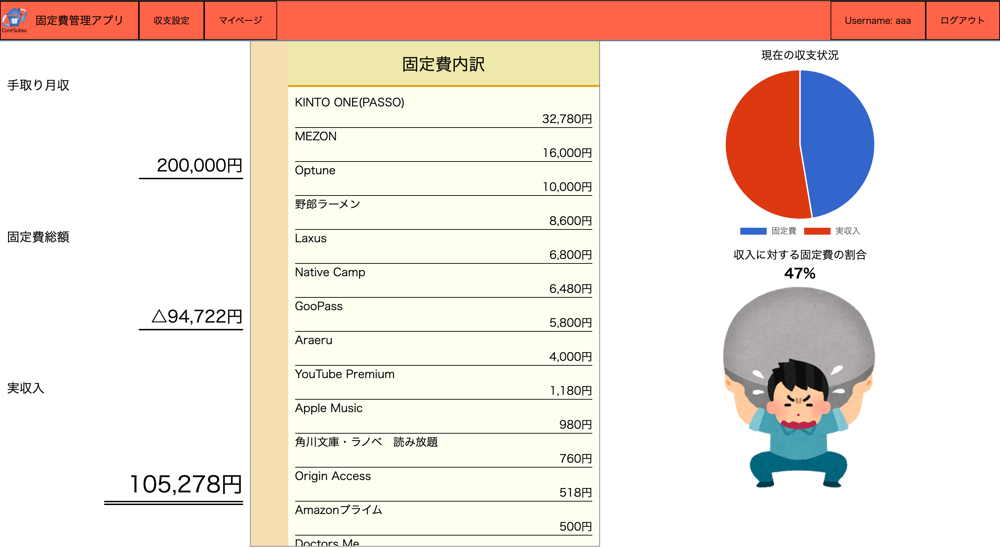

# 固定費管理アプリContsubsc

## トップページ

## 収支設定ページ

## 収支詳細ページ

# 開発環境

* Ruby
* Ruby on Rails
* MySQL
* Visual Studio Code
* Github
* heroku

# DB設計

## incomesテーブル
|Column|Type|Options|
|------|----|-------|
|amount|integer|null: false|

### Association
- has_many :income_fixed_costs
- has_many :fixed_costs, through: :income_fixed_costs
- belongs_to :user

## fixed_costsテーブル
|Column|Type|Options|
|------|----|-------|
|amount|string|null: false|
|name  |text  |null: false|

### Association
- has_many :income_fixed_costs
- has_many :incomes, through: :income_fixed_costs

## income_fixed_costsテーブル
|Column|Type|Options|
|------|----|-------|
|amount|string|null: false|
|name  |text  |null: false|

### Association
- has_many :income_fixed_costs
- has_many :incomes, through: :income_fixed_costs

## usersテーブル
|Column|Type|Options|
|------|----|-------|
|name              |string|null: false|
|email             |string|null: false|
|encrypted_password|string|null: false|

### Association
- has_one :income
